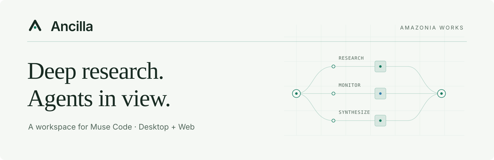
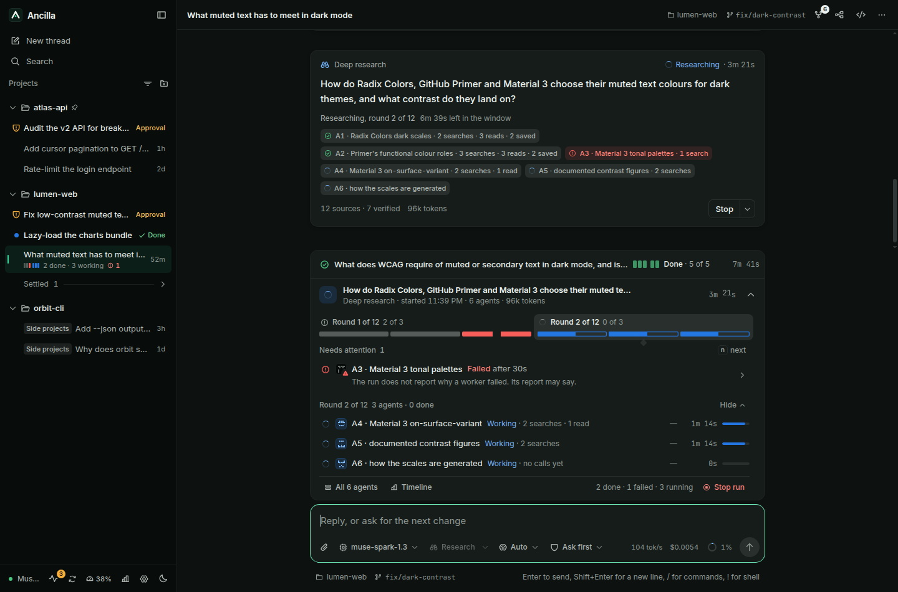
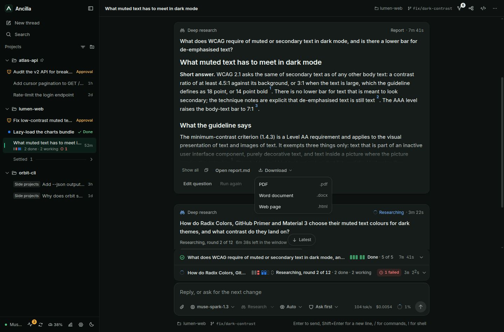
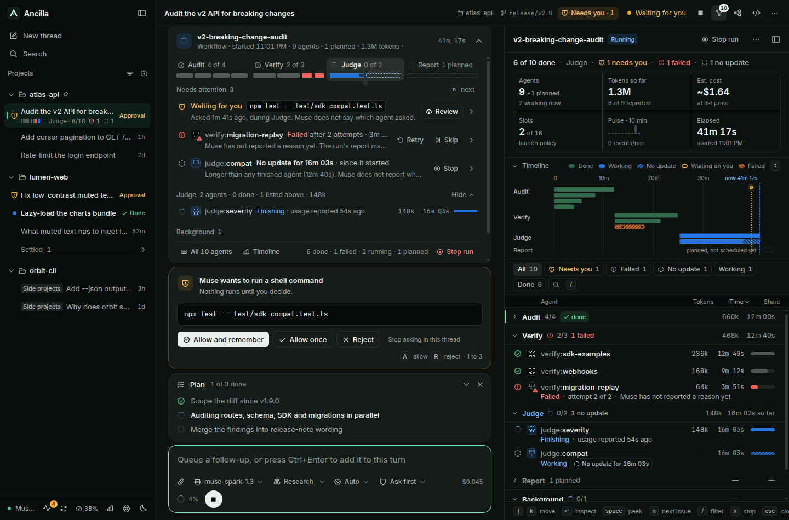
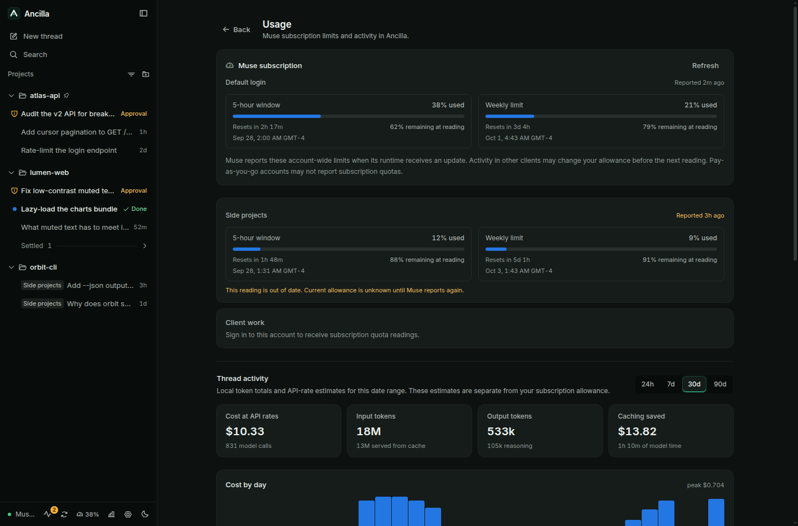
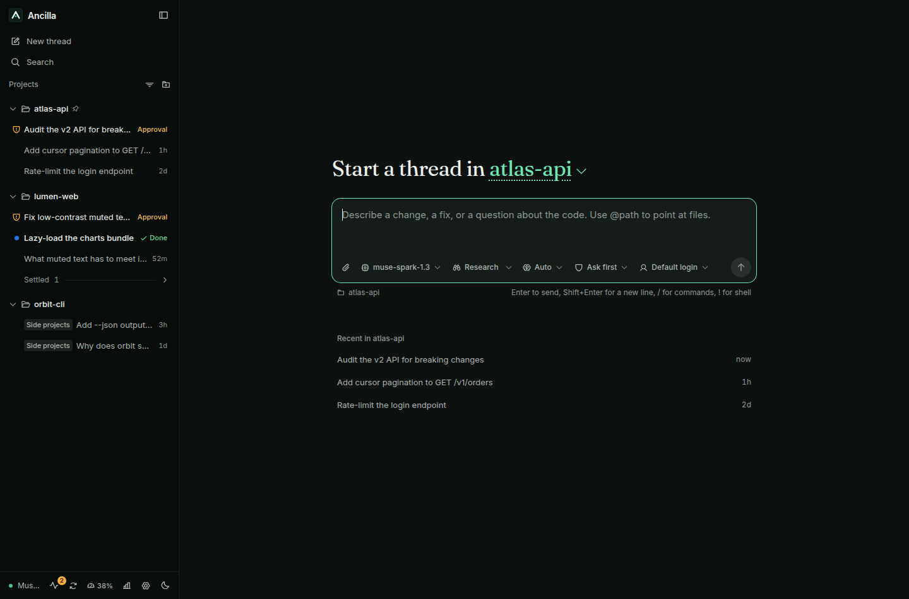
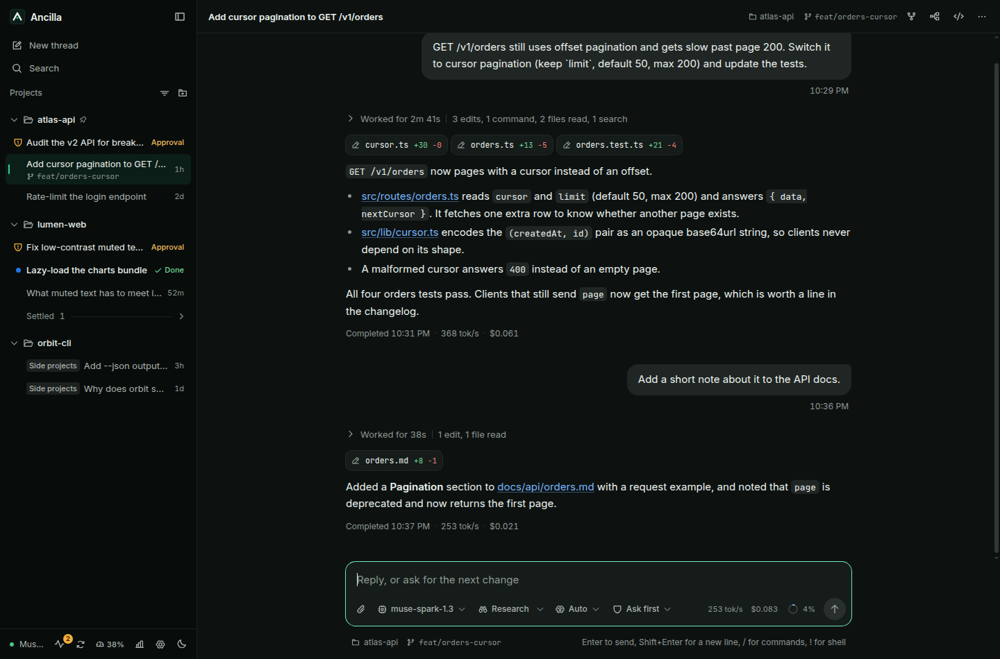
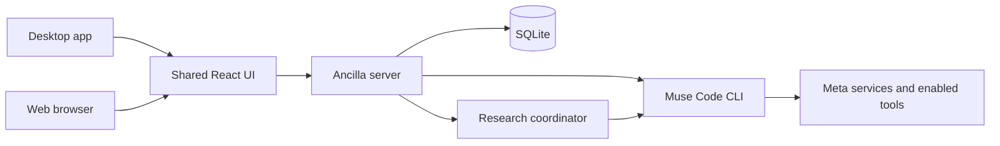

# Ancilla

[](LICENSE)
[](https://github.com/aleff-ferreira/ancilla/releases/latest)
[](https://github.com/aleff-ferreira/ancilla/releases/latest)



**Deep research and agent monitoring for Muse Code.**

Ancilla is an open-source desktop and web app from **AMAZONIA WORKS**. Turn a question into a cited research report,
follow parallel agents as they work, and keep coding threads, approvals and background tasks in one workspace.
It connects to Meta's **Muse Code CLI** (`muse`) using your existing login, on Windows, macOS or Linux.

**[Download Ancilla](https://github.com/aleff-ferreira/ancilla/releases/latest)** ·
[Deep Research](#deep-research) · [Crew monitoring](#crew-agent-monitoring) ·
[Build from source](#build-from-source) · [Changelog](docs/CHANGELOG.md)

> **Unofficial community project.** Ancilla is not made, endorsed, or supported by Meta, and is not affiliated with Meta.
> It is a client for the **Muse Code CLI** and is unrelated to the Muse assistant app for Mac. "Muse" and "Muse Code"
> are trademarks of Meta, used here only to describe what this client connects to.

## Deep Research

Ask a question, set a research window, and let Muse workers investigate in parallel. Ancilla coordinates the brief,
research rounds and final writer, then puts the report back in the same thread. Model calls, web searches and page
reads run through Muse; no separate model or search API key is needed.



*Screenshots throughout this page use representative demo threads and sample reports, activity and quota values.*

1. **Set the scope.** Switch on **Research** in the composer, type your question, and choose the time window and
   number of parallel workers from **Research options**. `Ctrl/Cmd+Shift+R` toggles research mode.
2. **Follow the work.** See the current phase, worker states, searches, page reads and source counts in the thread
   and Crew panel.
3. **Keep control.** Let the run finish, stop and ask for a report from its findings so far, or stop immediately.
   A partial report is labelled as such.
4. **Read and reuse.** Follow the report's numbered citations, copy its Markdown, open `report.md`, or download
   **PDF, Word or HTML**. Edit the question or run it again with the same options.

### Reports with traceable sources

Ancilla builds the citation registry from URLs observed in the workers' searches and page reads, deduplicates sources,
and turns registered citations into linked footnotes. This checks source provenance; it does not independently
verify every claim in the report.



Reports and source registries are saved under `.ancilla/research/<runId>/` in the project. Run history persists across
restarts; **resuming an interrupted research run is not available yet**. You can start it again from its question.
The [research implementation notes](docs/deep-research-plan.md#12-implementation-notes-what-the-build-changed)
describe the engine, budgets and current limits.

## Crew: agent monitoring

See the work behind the lead agent's replies. Crew brings Muse workflows, native subagents, Deep Research workers
and background shell tasks into the thread's monitoring surfaces.



| Surface | What you can follow |
| --- | --- |
| **Crew card** | A compact run summary above the composer: phase, completed agents, pending requests and failures. Expand it for agent rows and controls. |
| **Crew panel** | Workflow and research timelines, phase groups, filters, an agent inspector, recorded lifecycle events, token totals and completion summaries. Open with `Ctrl/Cmd+Shift+M`. |
| **Background tasks** | The command, current state and latest output, with output inspection and task controls. |
| **Activity drawer** | Pending requests across threads, plus runs and tasks from threads this window has opened. Open with `Ctrl/Cmd+Shift+A`. |
| **Sidebar** | Small phase and progress indicators alongside each tracked thread, so you can switch context without losing the overview. |

Review approvals, inspect a failure, and retry, skip or stop work where Muse exposes those controls. Research workers
show their search, read and saved-source counts; research runs use their own stop and report controls.

The display stays explicit about what is known. Missing token counts remain unreported, elapsed silence is shown as
**No update** rather than a guessed failure, and a disconnected feed is marked **Last known**. Workflow requests stay
at run level when Muse does not identify the requesting agent. Cost figures are list-price estimates.
See [Agents and tasks](docs/agent-activity.md) for the full interaction model and Muse's reporting limits.

## Subscription usage, alongside local activity

The Usage page shows Muse's reported **5-hour window and weekly limits**, including used and remaining percentages,
reset times and the source account. Refresh reads the runtime's latest observation without starting a model turn.
Saved, stale and unavailable readings are labelled; an absent reading never appears as an unused allowance.



Below the subscription section, explore local token history by date, model and thread. **API-rate cost estimates are
separate from subscription allowance and are not a bill.** Quota availability depends on what Muse reports; activity
in other clients may change the allowance before the next observation, and pay-as-you-go accounts may not report
subscription windows.

## The everyday workspace

| Capability | In Ancilla |
| --- | --- |
| **Projects and threads** | Group folders into projects, pin and archive threads, and discover sessions started from the `muse` terminal. |
| **Conversation control** | Read streamed replies and diffs; approve, steer, stop, queue and resend prompts using Muse's approval modes. |
| **Files beside the work** | Browse the project and preview files without leaving the thread. |
| **Multiple logins** | Choose named Muse accounts and set a default account per project. |
| **Desktop and web** | Use the same interface in a Tauri desktop app or a browser connected to a local or remote server. |

<details>
<summary>Home and coding thread screenshots</summary>





</details>

## Install

Download the installer for your platform from the
[latest release](https://github.com/aleff-ferreira/ancilla/releases/latest). Ancilla bundles its own Node.js, so the
only requirement is the `muse` CLI with `muse login` done once, however you installed it. Ancilla uses the login you
already have; there is no separate Ancilla account to create.

**Windows:** run `Ancilla_<version>_x64-setup.exe`. The installer is not Authenticode-signed yet, so SmartScreen may
warn that it is from an unknown publisher; choose **More info**, then **Run anyway**. Updates after that are
signature-checked by Ancilla's built-in updater before they install.

Install Muse Code for Windows with `irm https://dev.meta.ai/install.ps1 | iex` in PowerShell. Already run Muse inside
WSL2? Ancilla uses it when native Muse is not installed; set `ANCILLA_MUSE_RUNTIME=wsl`, or `"runtime": "wsl"` in
[`runtime.json`](docs/muse-recovery.md#runtime-configuration), to keep WSL when both are.

**macOS:** open `Ancilla_<version>_universal.dmg`; one build runs on Apple Silicon and Intel. The app is not
Apple-notarized yet, so the first launch needs a right-click on the app, then **Open** (on recent macOS, **System
Settings > Privacy & Security > Open Anyway**).

**Linux:** download `Ancilla_<version>_amd64.AppImage` (x86_64). It runs on most distributions; some need FUSE
(`libfuse2`). Make it executable and run it (`chmod +x Ancilla_*.AppImage`, then `./Ancilla_*.AppImage`), or allow
executing it as a program in your file manager.

The desktop app updates itself from this repository's releases, and Settings can pause that. To hear about new
versions, use **Watch > Custom > Releases** at the top of this page.

### Migrating from Helicon

Ancilla has its own app identifier and data directory. On first start, it can import Helicon's database and runtime
settings into its own copy; Helicon's files are read but never modified. Browser preferences and drafts also carry
over when you use the same address. Muse threads are discovered directly from Muse.
See [Migrating from Helicon](docs/migrating-from-helicon.md) for exactly what comes across and where it is stored.

## Build from source

Prerequisites: Node 22+, the `muse` CLI with `muse login` done once (natively, or in WSL2 on Windows), and this
repository checked out.

```bash
npm ci
npm run build --workspace @ancilla/daemon --workspace @ancilla/ui --workspace @ancilla/server
npm run build --workspace @ancilla/web
npm test

# Web app (serves the built UI plus the API on :3127)
npm run serve --workspace @ancilla/web
# open http://127.0.0.1:3127, add a folder, start a thread
```

Projects, pins, thread titles and archive state persist in `~/.ancilla/ancilla.db` (pass `--data-dir` to the server to
move it, or `:memory:` for a throwaway run). The desktop app keeps the same files in its own app data directory. Threads
you started from the `muse` terminal are discovered automatically and appear under their project.

UI development with hot reload:

```bash
# terminal 1: the API against your real muse
node packages/server/dist/src/cli.js --port 3127
# terminal 2: Vite compiles packages/ui straight from source
npm run dev --workspace @ancilla/web
# open http://127.0.0.1:5173
```

To explore the interface with sample data and no Muse calls:

```bash
npm run demo --workspace @ancilla/web
# open http://127.0.0.1:5299/demo.html
```

The [repository map](#repository-map) below points to the main packages. Design tokens and the visual system are
documented in [docs/DESIGN.md](docs/DESIGN.md).

```bash
# Desktop app (dev shell; needs Rust and the Tauri prerequisites for your OS)
npm run dev --workspace ancilla-desktop
```

A local `tauri build` signs update artifacts, so it needs `TAURI_SIGNING_PRIVATE_KEY` and
`TAURI_SIGNING_PRIVATE_KEY_PASSWORD` set; pass `--config '{"bundle":{"createUpdaterArtifacts":false}}'` to skip that
for a build you only run yourself.

Releases ride on tags: pushing `vX.Y.Z` runs the Release workflow, which builds the Windows installer, then the universal
macOS build, then the Linux AppImage, and attaches them to a GitHub Release with the updater's `latest.json`. Releases
must not be marked prerelease, or the updater will not see them.

## Remote daemon

The web app can run against a server on another machine. Start it there with a token and the origin that will load the
page:

```bash
node packages/server/dist/src/cli.js --host 0.0.0.0 --port 3127 \
  --token "$(openssl rand -hex 24)" --allow-origin https://ancilla.example
```

Then load the page, go to `#/connect`, and give it the address and the token. Both are kept in local storage rather
than in the URL: the token is exchanged once for an `HttpOnly` cookie, which is what the event stream authenticates
with, since `EventSource` cannot carry a header.

Two things fail closed deliberately:

- An origin that was never passed to `--allow-origin` gets no CORS headers and no answer at all.
- A token in the query string counts only for requests carrying no other site's origin, so a copied link hands over
  nothing.

Browsers only accept cross-site cookies over HTTPS, so a server reached from another origin needs TLS or a tunnel in
front of it. On the same machine none of this applies: `#/connect` with an empty address uses the server that served
the page, and no token is needed unless one was set.

## Architecture

A Node.js server connects the shared interface to Muse through its session protocol and stores Ancilla's state in
SQLite. The desktop app bundles that server and Node.js; the web app connects to the same API on a local or remote
machine. Muse handles model and tool execution under the selected Muse account.



### Repository map

| Path | Responsibility |
| --- | --- |
| [`packages/ui`](packages/ui) | React components and state models; Crew projections live in `src/model/crew.ts`. |
| [`packages/daemon`](packages/daemon) | Muse sessions, runtime discovery and SQLite storage. |
| [`packages/daemon/src/research`](packages/daemon/src/research) | Research supervision, budgets, prompts and citation processing. |
| [`packages/server`](packages/server) | HTTP/SSE API, accounts, project files and research job coordination. |
| [`packages/server/src/research`](packages/server/src/research) | Muse research adapters, job lifecycle and PDF/DOCX/HTML export. |
| [`apps/web`](apps/web) | Browser entry point, API client, theme tokens and demo fixtures. |
| [`apps/desktop`](apps/desktop) | Tauri shell, bundled server and desktop updater. |

Start with [Product](docs/PRODUCT.md), [Design](docs/DESIGN.md), [agent monitoring](docs/agent-activity.md) or
[Muse recovery](docs/muse-recovery.md). Release maintenance is documented in [Releasing](docs/RELEASING.md).

## Data and connections

Ancilla keeps project metadata and activity history in its server's local SQLite database, with research reports in
the project folder. Muse maintains its own sessions and login. There is no Ancilla-hosted account service, telemetry
or analytics in the app. **Running Muse can send prompts, code and other context to Meta's services and enabled
tools**; local storage does not mean model execution stays on your machine.

The desktop app makes an automatic **update check** soon after launch and every six hours, fetching `latest.json` from this repository's
[GitHub Releases](https://github.com/aleff-ferreira/ancilla/releases). A newer version's installer is downloaded from
the same release, and its signature is verified before it installs. **Pause updates** in Settings stops the automatic
checks. The web app has no updater.

Other connections follow from the work you request or the content you open:

- **Muse Code itself** talks to Meta's services under your login; that is what running an agent means. Features that
  call `muse` for you include Deep Research, generated thread titles (a `muse exec` call, with a switch in Settings)
  and in-app `muse login`. Ancilla does not require a separate provider credential for research.
- **Images in Markdown** that point at a web address, in Muse's replies or in a Markdown file you preview, load from
  that address, the same way a browser shows them. The interface does not block or proxy them.
- **Adding a project from a Git URL** runs `git clone` on your machine.
- **The web app** connects to the server address you give it on `#/connect`.
- **Links in replies** open in your default browser.
- **Building from source** downloads npm packages, and the desktop build downloads Node.js from `nodejs.org`.

## Legal

- Wrapper clients are the intended path: Meta ships an MIT-licensed SDK for building MSP clients, and Ancilla is built
  on it.
- **Name:** `Ancilla` avoids the `Muse` mark. Do not introduce `Muse` into the binary name, bundle ID, domain or title.
- Ancilla never claims to be official, never bundles credentials, and never bypasses billing or approvals.
- Contributor-tier models: prompts and completions sent to them may be used to improve Meta's products. The model
  picker marks those models and says so.
- See also: [Meta Brand Resources](https://www.meta.com/brand/resources/meta/our-trademarks),
  [Muse Code product page](https://developer.meta.com/ai/products/muse-code),
  [Model API docs](https://dev.meta.ai/docs/coding-agents).

This section is not legal advice.

## Contributing

See [CONTRIBUTING.md](CONTRIBUTING.md); pull requests are welcome. Report vulnerabilities as described in
[SECURITY.md](SECURITY.md), not in a public issue.

## License

[GNU AGPL v3](LICENSE). Copyright (c) 2026 Aleff Ferreira Francisco. Anyone who changes Ancilla and runs it for others,
or ships it, must offer their version's source under the same license.

Portions of Ancilla derive from Helicon, Copyright (c) 2026 Harjot Singh Rana and contributors, under the MIT License; its notice is kept in [LICENSE-HELICON](LICENSE-HELICON).
The research engine selectively ports Deep Dog 2 by Benjamin Andrew Eadie, building on ThinkDepth Deep Research by
Paichun Lin; see [NOTICE.md](NOTICE.md) and the [upstream map and MIT notices](packages/daemon/src/research/UPSTREAM.md).
Bundled third-party software is listed with its licenses in [THIRD_PARTY_NOTICES.md](THIRD_PARTY_NOTICES.md).
