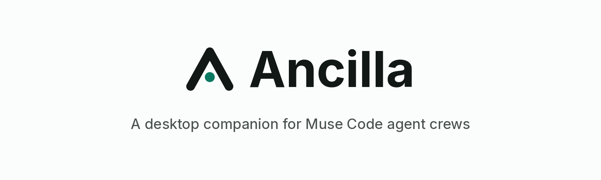
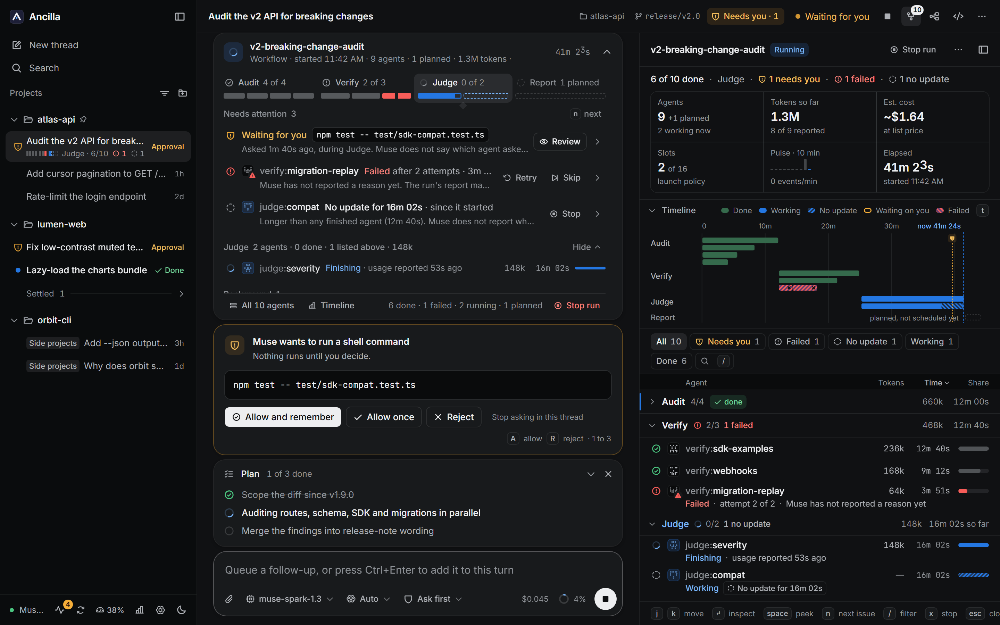
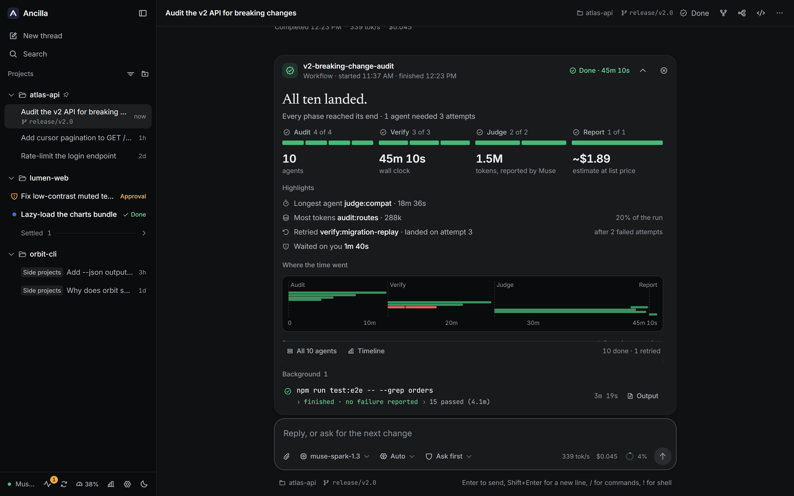
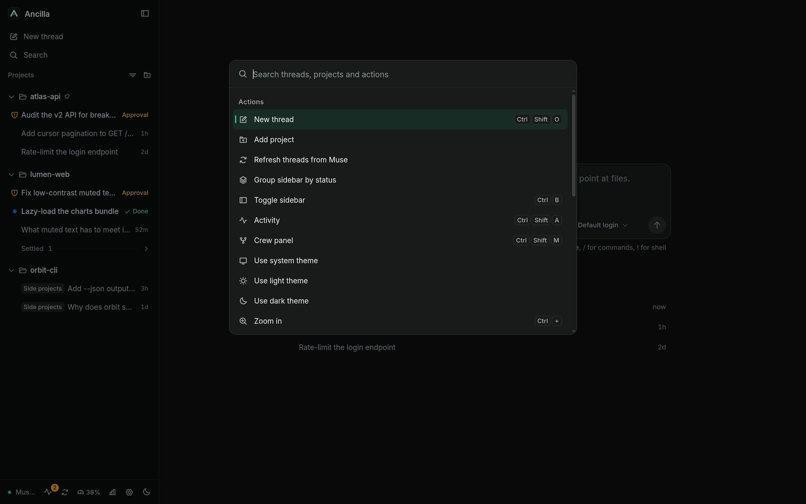
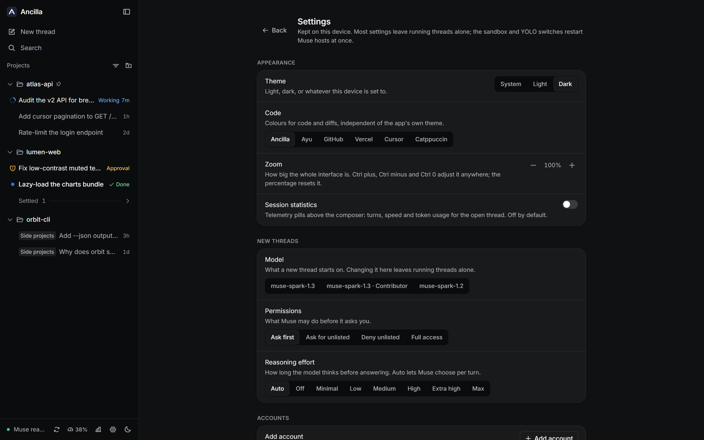

# Ancilla

[](LICENSE)
[](https://github.com/aleff-ferreira/ancilla/releases/latest)
[](https://github.com/aleff-ferreira/ancilla/releases/latest)
[](https://tauri.app)

<picture>
  <source media="(prefers-color-scheme: dark)" srcset="docs/assets/readme-hero-dark.png" />
  <source media="(prefers-color-scheme: light)" srcset="docs/assets/readme-hero-light.png" />
  
</picture>

> **Ancilla** (Latin for "helper" or "handmaid") is an open-source desktop and web app for Meta's **Muse Code CLI**
> (`muse`): it looks after your agent threads while Muse does the work.

Ancilla puts every Muse Code thread you run into one window: projects grouped by the folder the agent worked in, each
with its threads, which you can read, resume, steer and approve without opening the terminal UI, including threads
started from the `muse` TUI. It talks to the `muse` CLI on your own machine over the Muse Session Protocol, with your
own login, and keeps its own state in a local SQLite file. Ancilla is a fork of
[Helicon](https://github.com/HarjjotSinghh/helicon) v0.17.1 that adds recovery for stalled Muse sessions, an Agents
panel for native subagents and workflows, and fixes for Windows and WSL; see [NOTICE.md](NOTICE.md).

> **Unofficial community project.** Ancilla is not made, endorsed, or supported by Meta, and is not affiliated with Meta.
> It is a client for the **Muse Code CLI** and is unrelated to the Muse assistant app for Mac. "Muse" and "Muse Code"
> are trademarks of Meta, used here only to describe what this client connects to. Ancilla is also not affiliated with
> or endorsed by the Helicon project.


## Features

### From Helicon

- **Projects** grouped by the directory the agent worked in, including isolated worktrees
- **Threads** per project with full history, resume and diffs, including sessions started from the `muse` TUI
- **Approvals** surfaced honestly (`onRequest / promptUnmatched / denyUnmatched`), never bypassed
- **One codebase** for desktop (Tauri) and web (the same React UI against a local or remote server)
- **Windows that works**: Muse Code for Windows natively (no WSL), or Muse inside WSL2 with path translation
- **A file viewer beside the thread**: browse the project, read highlighted source, preview and edit Markdown, and view
  images, video and PDFs; paths Muse Code mentions open there
- **Your real plan meter**: the 5-hour window and weekly cap as Muse Code reports them, in the sidebar and on the usage
  page
- **Goals you can steer**: set, pause, resume, change and clear a `/goal` from the goal panel or the composer
- **Background work under control**: send a running tool call to the background, stop one or all of them; cancel a
  workflow run, or skip and retry its agents
- **Reasoning effort that sticks**, applied as the session's own default, which is the level `muse serve` actually uses
- **More than one Muse login**: named profiles, each project remembering which one its new threads start on

### New in Ancilla

- **Session recovery that never resends work.** When Muse's live feed stalls, Ancilla keeps the thread moving by reading
  its saved progress, and says so in the thread. It never resends a prompt, never resumes a running turn and never
  restarts delegation to catch up. [How it works](docs/muse-recovery.md)
- **A Swarm card in every thread** that runs native Muse subagents, workflow children or background tasks. One line
  answers whether everything is fine, what needs you and how far along the run is; the rows that need attention
  (waiting on you, failed, no update) carry the reason and the action; each agent has its own mark. A docked
  **Swarm panel** adds a timeline of the run, a filterable roster, an inspector per agent and keyboard navigation;
  a cross-thread **Activity** drawer (Ctrl+Shift+A) lists everything running and everything waiting on you; a
  finished run becomes a report with highlights and where the time went. Nothing is inferred: what Muse does not
  report says so. [Details](docs/agent-activity.md)
- **No duplicate prompt bubbles.** A prompt with attachments shows once, not once for Muse's saved copy and once for the
  local preview. [Details](docs/prompt-echo-reconciliation.md)
- **Thread titles stay local.** Titles live in Ancilla's database and are not sent to Muse, which works around a Muse
  1.4.0 bug where a renamed session breaks a later workflow's event log; sharing them is a `runtime.json` opt-in.
  [Configuration](docs/muse-recovery.md#local-thread-titles)
- **Windows and WSL fixes:** projects opened from `\\wsl.localhost\<distro>\...`, an existing `muse login` recognised
  on Windows and in WSL, and a per-machine `runtime.json` that pins the runtime, the distro and the `muse` path and
  forwards environment variables into WSL (for example a file-based credential store).
- **Projects with several folders.** A project can group more than one folder: "Add folder…" in a project's menu
  puts another folder under it, and a folder that was a project of its own moves in with its threads. Each thread
  still runs in exactly one folder, because Muse gives a session one workspace root; the project simply lists the
  threads of all its folders together, and the new-thread page lets you pick which folder to start in.
- **Deep research.** A Research button beside the model picker, or `/research <question>`, sends parallel Muse
  workers out to search the web and read what they find, round after round under a supervisor, until a writer turns
  their notes into a Markdown report in the thread. The row in the transcript shows the phase, each worker's searches
  and reads, the sources found and verified, the tokens spent and the time left in the window, with Stop that either
  writes a report from what it has or drops the run. Every model call and every search runs through Muse on your
  plan, so there is no key to add and the cost lands on the Usage page; a citation only ever names a page a worker
  actually opened. First release: the report reads inline and lands in `.ancilla/research/` in the workspace, and a
  run cut off by a restart stays interrupted until a later release can resume it.









<details>
<summary>Usage and settings</summary>




</details>

## Install

Download the installer for your platform from the
[latest release](https://github.com/aleff-ferreira/ancilla/releases/latest). Ancilla bundles its own Node.js, so the
only requirement is the `muse` CLI with `muse login` done once, however you installed it. Ancilla uses the login you
already have and never stores credentials of its own.

**Windows:** run `Ancilla_<version>_x64-setup.exe`. The installer is not Authenticode-signed yet, so SmartScreen may
warn that it is from an unknown publisher; choose **More info**, then **Run anyway**. Updates after that are
signature-checked by Ancilla's built-in updater before they install.

Install Muse Code for Windows with `irm https://dev.meta.ai/install.ps1 | iex` in PowerShell. Already run Muse inside
WSL2? Ancilla uses it when native Muse is not installed; set `ANCILLA_MUSE_RUNTIME=wsl`, or `"runtime": "wsl"` in
[`runtime.json`](docs/muse-recovery.md#runtime-configuration), to keep WSL when both are.

**macOS:** open `Ancilla_<version>_universal.dmg`; one build runs on Apple Silicon and Intel. The app is not
Apple-notarized yet, so the first launch needs a right-click on the app, then **Open** (on recent macOS, **System
Settings > Privacy & Security > Open Anyway**).

**Linux:** download `Ancilla_<version>_amd64.AppImage` (x86_64). It runs on most distributions; some need FUSE
(`libfuse2`). Make it executable and run it (`chmod +x Ancilla_*.AppImage`, then `./Ancilla_*.AppImage`), or allow
executing it as a program in your file manager.

The desktop app updates itself from this repository's releases, and Settings can pause that. To hear about new
versions, use **Watch > Custom > Releases** at the top of this page.

### Migrating from Helicon

Ancilla has its own app identifier, data directory and settings, so it installs beside Helicon and does not read or
change Helicon's data. [docs/migrating-from-helicon.md](docs/migrating-from-helicon.md) covers carrying your projects,
titles and settings across.

## Build from source

Prerequisites: Node 22+, the `muse` CLI with `muse login` done once (natively, or in WSL2 on Windows), and this
repository checked out.

```bash
npm ci
npm run build --workspace @ancilla/daemon --workspace @ancilla/ui --workspace @ancilla/server
npm run build --workspace @ancilla/web
npm test

# Web app (serves the built UI plus the API on :3127)
npm run serve --workspace @ancilla/web
# open http://127.0.0.1:3127, add a folder, start a thread
```

Projects, pins, thread titles and archive state persist in `~/.ancilla/ancilla.db` (pass `--data-dir` to the server to
move it, or `:memory:` for a throwaway run). The desktop app keeps the same files in its own app data directory. Threads
you started from the `muse` terminal are discovered automatically and appear under their project.

UI development with hot reload:

```bash
# terminal 1: the API against your real muse
node packages/server/dist/src/cli.js --port 3127
# terminal 2: Vite compiles packages/ui straight from source
npm run dev --workspace @ancilla/web
# open http://127.0.0.1:5173
```

The interface lives in `packages/ui` (state model in `src/model`, components in `src/components`); design tokens and the
visual system are documented in [docs/DESIGN.md](docs/DESIGN.md).

```bash
# Desktop app (dev shell; needs Rust and the Tauri prerequisites for your OS)
npm run dev --workspace ancilla-desktop
```

A local `tauri build` signs update artifacts, so it needs `TAURI_SIGNING_PRIVATE_KEY` and
`TAURI_SIGNING_PRIVATE_KEY_PASSWORD` set; pass `--config '{"bundle":{"createUpdaterArtifacts":false}}'` to skip that
for a build you only run yourself.

Releases ride on tags: pushing `vX.Y.Z` runs the Release workflow, which builds the Windows installer, then the universal
macOS build, then the Linux AppImage, and attaches them to a GitHub Release with the updater's `latest.json`. Releases
must not be marked prerelease, or the updater will not see them.

## Remote daemon

The web app can run against a server on another machine. Start it there with a token and the origin that will load the
page:

```bash
node packages/server/dist/src/cli.js --host 0.0.0.0 --port 3127 \
  --token "$(openssl rand -hex 24)" --allow-origin https://ancilla.example
```

Then load the page, go to `#/connect`, and give it the address and the token. Both are kept in local storage rather
than in the URL: the token is exchanged once for an `HttpOnly` cookie, which is what the event stream authenticates
with, since `EventSource` cannot carry a header.

Two things fail closed deliberately:

- An origin that was never passed to `--allow-origin` gets no CORS headers and no answer at all.
- A token in the query string counts only for requests carrying no other site's origin, so a copied link hands over
  nothing.

Browsers only accept cross-site cookies over HTTPS, so a server reached from another origin needs TLS or a tunnel in
front of it. On the same machine none of this applies: `#/connect` with an empty address uses the server that served
the page, and no token is needed unless one was set.

## Architecture

```
packages/daemon  Node library: spawns `muse serve` per workspace, speaks MSP (JSON-RPC over stdio), local SQLite store
packages/server  HTTP + server-sent events bridge between the UI and the daemon
packages/ui      shared React UI (desktop + web, single source of truth)
apps/desktop     Tauri 2 shell (Windows, macOS, Linux) that runs the bundled server and shows packages/ui
apps/web         the same UI in a browser, against a local or remote server
```

- Protocol: the **Muse Session Protocol (MSP)** via the official
  [`@muse-code/sdk`](https://github.com/meta-models/muse-code-sdk) (MIT) and `muse schema generate-ts` types. No TUI
  scraping.
- Auth: your own `muse login`. Ancilla never stores credentials.
- State: local SQLite, `projects (cwd/worktree) > sessions > turns`.
- Windows: Muse for Windows runs natively; Muse in WSL2 runs through `wsl.exe`, with project paths translated between
  Windows and WSL.

## What leaves your machine

Your code, prompts, threads and files stay where they are. Ancilla talks to the `muse` CLI on your own computer, with
your own login, and keeps its state in SQLite beside it. There is no account, no telemetry and no analytics in the app.

The only request Ancilla makes on its own schedule is the desktop app's **update check**: soon after launch and every
six hours it fetches `latest.json` from this repository's
[GitHub Releases](https://github.com/aleff-ferreira/ancilla/releases). A newer version's installer is downloaded from
the same release, and its signature is verified before it installs. **Pause updates** in Settings stops the automatic
checks. The web app has no updater.

Other traffic happens because of Muse or because of what you open:

- **Muse Code itself** talks to Meta's services under your login; that is what running an agent means. Features that
  call `muse` for you, like generated thread titles (one `muse exec` call on your plan, and a switch in Settings) and
  in-app `muse login`, go the same way.
- **Images in Markdown** that point at a web address, in Muse's replies or in a Markdown file you preview, load from
  that address, the same way a browser shows them. The interface does not block or proxy them.
- **Adding a project from a Git URL** runs `git clone` on your machine.
- **The web app** connects to the server address you give it on `#/connect`.
- **Links in replies** open in your default browser.
- **Building from source** downloads npm packages, and the desktop build downloads Node.js from `nodejs.org`.

## Legal

- Wrapper clients are the intended path: Meta ships an MIT-licensed SDK for building MSP clients, and Ancilla is built
  on it.
- **Name:** `Ancilla` avoids the `Muse` mark. Do not introduce `Muse` into the binary name, bundle ID, domain or title.
- Ancilla never claims to be official, never bundles credentials, and never bypasses billing or approvals.
- Contributor-tier models: prompts and completions sent to them may be used to improve Meta's products. The model
  picker marks those models and says so.
- See also: [Meta Brand Resources](https://www.meta.com/brand/resources/meta/our-trademarks),
  [Muse Code product page](https://developer.meta.com/ai/products/muse-code),
  [Model API docs](https://dev.meta.ai/docs/coding-agents).

This section is not legal advice.

## Credits

Ancilla is built on [Helicon](https://github.com/HarjjotSinghh/helicon) by Harjot Singh Rana and the
[Helicon contributors](https://github.com/HarjjotSinghh/helicon/graphs/contributors). Nearly everything described above
under "From Helicon" is their work, and its full history is kept in this repository. Ancilla is not affiliated with or
endorsed by the Helicon project; [NOTICE.md](NOTICE.md) says what was forked and what changed. Bundled third-party
software is listed in [THIRD_PARTY_NOTICES.md](THIRD_PARTY_NOTICES.md).

## Contributing

See [CONTRIBUTING.md](CONTRIBUTING.md); pull requests are welcome. Report vulnerabilities as described in
[SECURITY.md](SECURITY.md), not in a public issue.

## License

[GNU AGPL v3](LICENSE). Copyright (c) 2026 Aleff Ferreira Francisco. Anyone who changes Ancilla and runs it for others,
or ships it, must offer their version's source under the same license.

Ancilla is a fork of [Helicon](https://github.com/HarjjotSinghh/helicon), Copyright (c) 2026 Harjot Singh Rana and
contributors, released under the MIT License. Helicon's notice is kept in [LICENSE-HELICON](LICENSE-HELICON), as that
license requires; everything Ancilla adds is under the AGPL.
